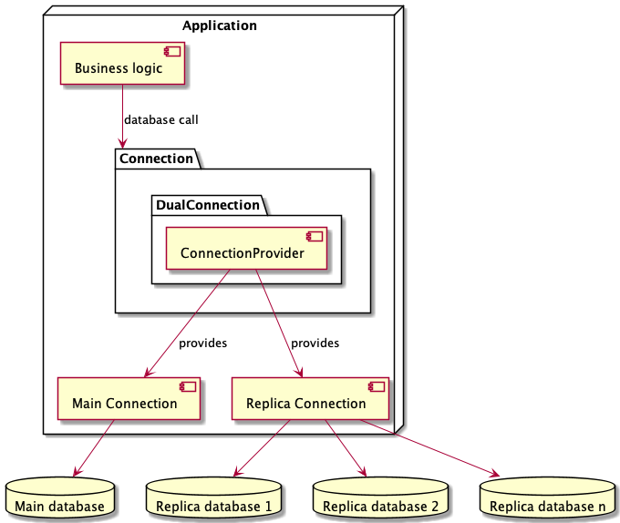

# db-replica

[](LICENSE)
[](CONTRIBUTING.md)

Using database replicas unlocks horizontal scalability. Some replica designs force replicas to be read-only.
Read-only queries can be sent to the replica, while others have to go to the main DB.
The `db-replica` API automatically routes the queries to the correct node.
It integrates at the `java.sql.Connection` level, so you don't have to hunt down hundreds of queries manually.



## Features

- [Automatic switching between main and replica databases](docs/switching-between-main-and-replica.md).
- [Configurable consistency model](docs/consistency.md).
- [Configurable circuit breaker](src/main/java/com/atlassian/db/replica/spi/circuitbreaker/CircuitBreaker.java).
- [Configurable main/replica split instrumentation](docs/split-instrumentation.md).
- [Connection state change listener](src/main/java/com/atlassian/db/replica/spi/state/StateListener.java).

## Usage

The library is [not available via Maven Central Repository](https://github.com/atlassian-labs/db-replica/issues/18) yet. It can be accessed via
[Atlassian Maven proxy](https://developer.atlassian.com/server/framework/atlassian-sdk/atlassian-maven-repositories-2818705/#atlassian-maven-proxy-).

```java
import com.atlassian.db.replica.api.*;
import java.sql.*;
import java.time.*;

class Example {

    private final ReplicaConsistency consistency = new PessimisticPropagationConsistency.Builder().build();

    ResultSet queryReplicaOrMain(String sql) {
        try (ConnectionProvider connectionProvider = new PostgresConnectionProvider()) {
            Connection connection = DualConnection.builder(connectionProvider, consistency).build();
            return connection.prepareStatement(sql).executeQuery();
        }
    }
}
```

## Installation

Maven:
```xml
<dependency>
    <groupId>com.atlassian.db.replica</groupId>
    <artifactId>db-replica</artifactId>
    <version>0.1.31</version>
</dependency>
```

## Documentation

See Javadoc of classes in the `api` and `spi` packages.
See [DualConnection states UML](docs/dual-connection-states.md).
See [how to release the library](docs/release/releasing.md).

## Tests

Run all checks: `./gradlew build`
Run just the unit tests: `./gradlew test`

## Contributions

Please see [CONTRIBUTING.md](CONTRIBUTING.md) for details.

## License

Apache 2.0 licensed, see [LICENSE](LICENSE) file.

[![With ❤️ from Atlassian][cheers img]](https://www.atlassian.com)

[cheers img]: https://raw.githubusercontent.com/atlassian-internal/oss-assets/master/banner-cheers-light.png
