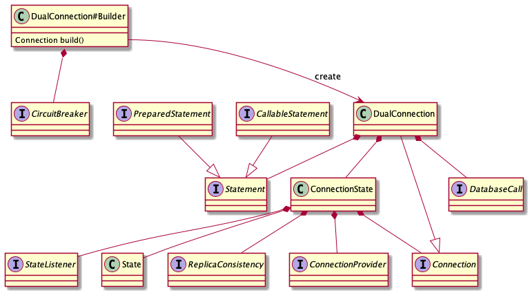

## Classes diagram

This diagram is intended to help understand how the library works internally. It may leak some implementation details and should not be used as API.

`DualConnection#Builder` creates [DualConnection](../src/main/java/com/atlassian/db/replica/api/DualConnection.java).
[CircuitBreaker](../src/main/java/com/atlassian/db/replica/spi/circuitbreaker/CircuitBreaker.java)
if [DualConnection](../src/main/java/com/atlassian/db/replica/api/DualConnection.java) can be created.
Every call that goes to the database directly through the connection or through
one of the `java.sql.Statement` implementations can be intercepted with
[DualCall](../src/main/java/com/atlassian/db/replica/spi/DualCall.java).

[ConnectionState](../src/main/java/com/atlassian/db/replica/internal/state/ConnectionState.java) is an internal class
that is the source of truth to the current [State](../src/main/java/com/atlassian/db/replica/api/state/State.java).
It can use [ConnectionProvider](../src/main/java/com/atlassian/db/replica/spi/ConnectionProvider.java)
to obtain a connection to a database. It utilises
[ReplicaConsistency](../src/main/java/com/atlassian/db/replica/spi/ReplicaConsistency.java) while transitioning
between states. [StateListener](../src/main/java/com/atlassian/db/replica/spi/state/StateListener.java) is called on each transition.
