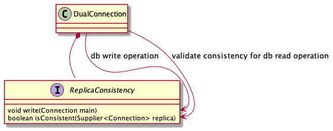

## Consistency

[DualConnection](../src/main/java/com/atlassian/db/replica/api/DualConnection.java) consistency is controlled by
[com.atlassian.db.replica.spi.ReplicaConsistency](../src/main/java/com/atlassian/db/replica/spi/ReplicaConsistency.java).

Currently, there's no default consistency implementation. Consistency model highly depends on the database and
application's needs. There's one example of the implementation for Postgres available in
[the integration test](../src/test/java/com/atlassian/db/replica/it/DualConnectionIT.java).

The easiest way to start is to use
[PessimisticPropagationConsistency](../src/main/java/com/atlassian/db/replica/api/PessimisticPropagationConsistency.java).

Every write operation is registered by `ReplicaConsistency#write` method.
[DualConnection](../src/main/java/com/atlassian/db/replica/api/DualConnection.java) verifies
the state of replica's consistency by calling `ReplicaConsistency#isConsistent` method.

