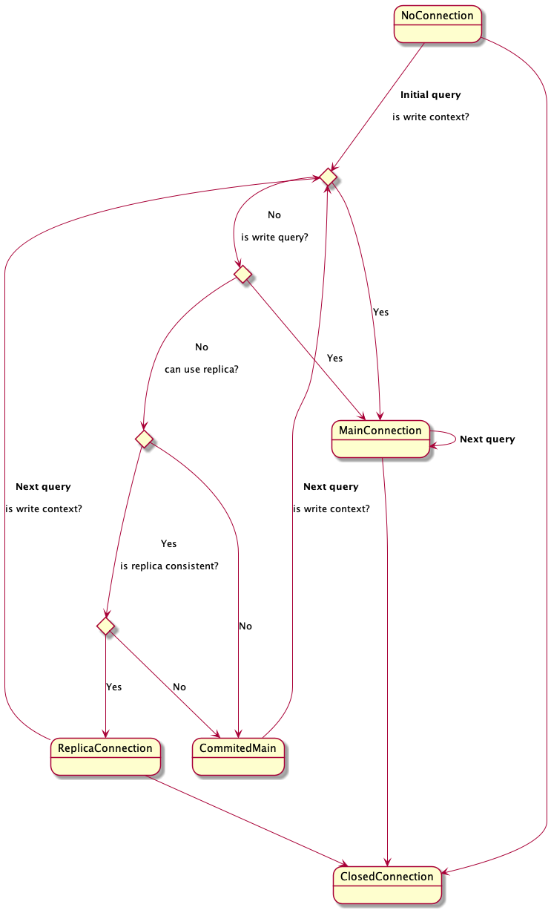

`DualConnection` chooses between main and replica database connections at query time.
The choose is postponed to a query time. When the first query arrives, one of the connections
will be initialised (main or replica). There's a sequence of choices to determine which
connection should be used.

`is write context?` - it's the first and the simplest check. Some statement methods like
`executeUpdate` are intended for writes.

`is write query?` - validates SQL query.

`is replica consistent?` - Uses provided `RelicaConsistency` implementation to determine if
the replica is ready to serve consistent responses.

If we ended in `ReplicaConnection` state, then the next query will go the same way.
`MainConnection` is a permanent state and `DualConnection` re-use main connection for
next queries.

