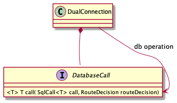

## Configurable main/replica split instrumentation

All calls to the database goes through [DatabaseCall](../src/main/java/com/atlassian/db/replica/spi/DatabaseCall.java).
By default [DualConnection](../src/main/java/com/atlassian/db/replica/api/DualConnection.java) forwards all the calls.
It can be used to log queries, gather metrics or to handle exceptions.

Every database operation on database will go through `DatabaseCall#call`.
